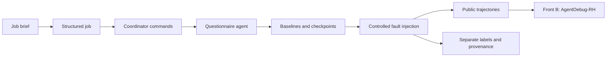

# Scenario Emulator · Front A

[🇧🇷 Português](README.md) · 🇺🇸 **English**

A failure simulator for recruitment agents. It generates questionnaires, records
execution trajectories, and builds controlled datasets for **AgentDebug-RH**,
which identifies the critical failure and proposes a correction.

[Get started](#get-started) · [Front A guide](docs/error-recovery.en.md) ·
[Development](docs/error-recovery.en.md#architecture-and-development) · [Fault catalog](docs/fault-injection-catalog.en.md) ·
[Data contract](docs/data-contracts/agentdebug.en.md)



The questionnaire security experiment, including answer generation, evaluation,
API, and its documentation, lives in [RecruitSecBench](https://github.com/PDC-PDAI/recruitSecBench).
This repository contains Front A's simulator and diagnostic datasets.

## Get started

Requirements: **Python 3.12+**, Git, `uv`, and an LLM provider for new baselines.
Tests and configuration validation do not require an LLM.

```bash
git clone https://github.com/PDC-PDAI/scenario-emulator.git
cd scenario-emulator
uv sync --locked
cp .env.example .env
```

Edit `.env` with your provider settings:

```dotenv
LLM_PROVIDER=openai
OPENAI_API_KEY=your-key
OPENAI_MODEL=gpt-5-mini
```

For Ollama, set `LLM_PROVIDER=ollama`, `OLLAMA_BASE_URL`, and `OLLAMA_MODEL` as
shown in [.env.example](.env.example). Langfuse is optional; without credentials,
the runtime uses local prompts.

```bash
# Offline verification
uv run scenario-emulator validate-profile configs/fronts/error_recovery.yaml
uv run pytest -q

# One real baseline; calls the configured provider
uv run scenario-emulator run \
  --profile configs/fronts/error_recovery.yaml \
  --brief "Vaga sênior de backend Python, FastAPI e PostgreSQL" \
  --benign 1
```

`error_recovery` is the default profile, including when `--profile` is omitted.
It generates three benign commands. Candidate answer generation, evaluation, and
their HTTP API belong to RecruitSecBench and are not included here.

## Reproduce campaigns

| Configuration | Planned result | Requirement |
|---|---|---|
| [100 cases](configs/campaigns/error-recovery-front-b-100.yaml) | Four `action` classes | New LLM baselines |
| [220 cases](configs/campaigns/error-recovery-front-b-220.yaml) | 20 cases per class, 11 classes | New LLM baselines |
| [1,100 cases](configs/campaigns/error-recovery-front-b-1100.yaml) | 100 cases per class; five distinct faults per baseline | Private baselines from the 220 campaign; offline expansion |
| [1,200 cases v2](docs/dataset-v2-success-controls.en.md) | 1,100 faults + 100 reviewed controls | Previous release, audit, and approved controls |

```bash
uv run scenario-emulator run-dataset \
  --campaign configs/campaigns/error-recovery-front-b-220.yaml \
  --max-parallel 10

# After collecting 220 valid baselines:
uv run scenario-emulator run-dataset \
  --campaign configs/campaigns/error-recovery-front-b-1100.yaml
```

Mutations operate on saved checkpoints from real executions. These are
**synthetic trajectory injections**, not fresh agent executions under failure.
New LLM collection reproduces the procedure, not necessarily identical text.
Historical `outputs/` datasets are not included in a clone.

```text
outputs/<campaign>/
├── front-b-input.jsonl   # aggregated detector input
├── front-b-inputs/       # one JSON per trajectory
├── labels.json          # ground truth, for evaluation only
└── private/             # baselines, checkpoints, and provenance
```

Keep labels outside detector input and keep derivatives of one baseline in the
same split. For false-positive measurement with v2 controls, follow the
[blind evaluation protocol](docs/dataset-v2-success-controls.en.md#blind-evaluation).

## AgentDebug-RH integration

The [self-contained `invalid_action` example](examples/error_recovery/invalid_action/README.en.md)
does not require historical datasets. Front A produces the `Trajectory` contract;
Front B diagnoses it; re-rollout belongs to Front C. This repository does not
execute recovery or demonstrate improvement after correction.

## Development

```bash
uv run ruff check .
uv run pytest -q
```

| Directory | Responsibility |
|---|---|
| `src/services/questionnaire/` | Agent, tools, and questionnaire validation |
| `src/services/dataset/` | Resumable collection, mutations, and campaign export |
| `src/services/agent_debug/` | Trajectory conversion and annotations |
| `src/schemas/` | Pydantic contracts and taxonomy |
| `src/prompts/` | Local prompts and optional Langfuse resolution |
| `scripts/` | Prompt synchronization and v2 control preparation |
| `tests/` | Contracts, integration, faults, and persistence without model calls |

See the [development section](docs/error-recovery.en.md#architecture-and-development)
to add a fault or change a contract. Historical Front A checkpoints with empty
security fields remain readable; security scenarios must be opened in RecruitSecBench.

## Bilingual documentation

| Topic | Português | English |
|---|---|---|
| Execution and campaigns | [Guia](docs/error-recovery.md) | [Guide](docs/error-recovery.en.md) |
| Architecture and development | [Guia](docs/error-recovery.md#arquitetura-e-desenvolvimento) | [Guide](docs/error-recovery.en.md#architecture-and-development) |
| Fault injection | [Catálogo](docs/fault-injection-catalog.md) | [Catalog](docs/fault-injection-catalog.en.md) |
| A → B contract | [Contrato](docs/data-contracts/agentdebug.md) | [Contract](docs/data-contracts/agentdebug.en.md) |
| v2 success controls | [Protocolo](docs/dataset-v2-success-controls.md) | [Protocol](docs/dataset-v2-success-controls.en.md) |

Prepared for [issue #20](https://github.com/PDC-PDAI/agentdebug-rh/issues/20).
