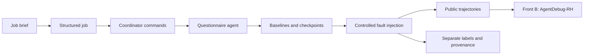

# Scenario Emulator · Front A

[🇧🇷 Português](README.md) · 🇺🇸 **English**

A failure simulator for recruitment agents. It generates questionnaires, records
execution trajectories, and builds controlled datasets for **AgentDebug-RH**,
which identifies the critical failure and proposes a correction.

[Get started](#get-started) · [Front A guide](docs/error-recovery.en.md) ·
[Development](docs/error-recovery.en.md#architecture-and-development) · [Fault catalog](docs/fault-injection-catalog.en.md) ·
[Data contract](docs/data-contracts/agentdebug.en.md)



Campaigns support evaluating critical-cause localization in trajectories with
known failures and measuring false positives with successful controls.

## Get started

Requirements: **Python 3.12+**, Git, `uv`, and an LLM provider for new baselines.
Tests and configuration validation do not require an LLM.

```bash
git clone https://github.com/PDC-PDAI/scenario-emulator.git
cd scenario-emulator
uv sync --locked
cp .env.example .env
```

Edit `.env` with your provider settings:

```dotenv
LLM_PROVIDER=openai
OPENAI_API_KEY=your-key
OPENAI_MODEL=gpt-5-mini
```

For Ollama, set `LLM_PROVIDER=ollama`, `OLLAMA_BASE_URL`, and `OLLAMA_MODEL` as
shown in [.env.example](.env.example). Langfuse is optional; without credentials,
the runtime uses local prompts.

```bash
# Offline verification
uv run scenario-emulator validate-profile configs/fronts/error_recovery.yaml
uv run pytest -q

# One real baseline; calls the configured provider
uv run scenario-emulator run \
  --profile configs/fronts/error_recovery.yaml \
  --brief "Vaga sênior de backend Python, FastAPI e PostgreSQL" \
  --benign 1
```

`error_recovery` is the default profile, including when `--profile` is omitted.
It generates three benign commands to collect questionnaire-agent baselines.

## Current campaign: 300 samples per model

The [fixed campaign](configs/campaigns/front-a-fixed-300.yaml) starts with
**Gemma 4 31B** on OpenRouter: **300 total samples, with 60 clean controls and
240 injected faults**. Its [versioned corpus](configs/inputs/front-a-300.json)
contains 10 jobs × 30 distinct commands. Every model receives the same jobs,
commands, IDs, guidelines and local prompts; no LLM regenerates these inputs.
Set `OPENROUTER_API_KEY` in `.env`, then run:

```bash
uv sync --locked
uv run scenario-emulator validate-dataset-campaign configs/campaigns/front-a-fixed-300.yaml

# Five-sample Gemma 4 31B pilot.
uv run scenario-emulator run-dataset \
  --campaign configs/campaigns/front-a-fixed-300.yaml \
  --limit 5 \
  --output-dir outputs/front-a-smoke-5/gemma-4-31b

# Full 300-sample Gemma 4 31B campaign.
uv run scenario-emulator run-dataset \
  --campaign configs/campaigns/front-a-fixed-300.yaml

# Same inputs and parameters for the other models.
uv run scenario-emulator run-dataset \
  --campaign configs/campaigns/front-a-fixed-300.yaml \
  --model google/gemma-4-26b-a4b-it
uv run scenario-emulator run-dataset \
  --campaign configs/campaigns/front-a-fixed-300.yaml \
  --model qwen/qwen3.5-9b
```

Settings are fixed in YAML: `temperature=0`, `top_p=1`, `max_tokens=8192`,
reasoning disabled, 2 transport retries, 120-second timeout and fault seed 42.
OpenRouter receives `require_parameters=true` and `allow_fallbacks=false`.
The model IDs are listed in the OpenRouter catalog:
[Gemma 31B](https://openrouter.ai/google/gemma-4-31b-it),
[Gemma 26B](https://openrouter.ai/google/gemma-4-26b-a4b-it),
[Qwen 9B](https://openrouter.ai/qwen/qwen3.5-9b).
**“GLM 3.5 Flash 320B” remains unconfirmed**; no substitute is selected.
Use its confirmed API ID with `--model` later.

`success_controls: 60` reserves six clean controls per job using the fixed seed.
The remaining 240 cases have 22 instances per fault type, except
`system_llm_limit` and `system_environment_error`, with 21 each. Every model uses
the same control positions and fault assignment. The five-sample pilot is the
exact prefix of the complete schedule, not a representative class distribution.

Use **`detector-input.jsonl`** for blind evaluation: it contains only
`trajectory_id`, `task_description`, `environment` and `steps`, mixing clean and
faulty cases. Keep **`labels.json`** separate: `null` means no expected fault;
otherwise the label contains `step`, `module` and `error_type`. Join predictions
and labels by ID only after inference. Do not expose labels, manifests, fault
assignments or `success` to the detector. `front-b-input.jsonl` retains the legacy
contract including `success`; Front B may skip `success=true` cases, so use the
blind input and analyze every case when measuring false positives.

`invalid_action`, `action_format_error`, `system_tool_execution_error` and
`system_llm_limit` rotate across compatible tool-call steps, with three variants
per position. Early mutations truncate the trajectory at the fault. Other types
retain their required semantic position. No steps are added merely to balance
positions. With two-step baselines, the planned distribution is 92 faults at
step 1 and 148 at step 2; longer baselines also expose intermediate steps for
flexible faults. Actual counts by type, step, type × step and original trajectory
length are written to `private/distribution.json`.

Repeat the same command and output directory to resume approved checkpoints.
Failed baselines, including successful runs with recovered natural tool errors, keep their original slot and are retried with the same input on
the next invocation. They are never replaced with another command; exit code 2
indicates pending samples. Each faulty case contains one injection; controls preserve the clean trajectory.
Controls require successful lookup and save, with consistent calls and responses
in the full message history.
Changes to the model, settings, corpus, code, dependencies or limit require a new
output directory. The private manifest records the protocol and hashes; rejected attempts are preserved in `private/rejected-executions/`. Keep
pilot and full runs separate, and assign the same input IDs to the same evaluation
split across models. Temperature zero does not guarantee identical new responses
from hosted backends; checkpoints preserve already collected results.

## Reproduce campaigns

| Configuration | Planned result | Requirement |
|---|---|---|
| [100 cases](configs/campaigns/error-recovery-front-b-100.yaml) | Four `action` classes | New LLM baselines |
| [220 cases](configs/campaigns/error-recovery-front-b-220.yaml) | 20 cases per class, 11 classes | New LLM baselines |
| [1,100 cases](configs/campaigns/error-recovery-front-b-1100.yaml) | 100 cases per class; five distinct faults per baseline | Private baselines from the 220 campaign; offline expansion |
| [1,200 cases v2](docs/dataset-v2-success-controls.en.md) | 1,100 faults + 100 reviewed controls | Previous release, audit, and approved controls |

```bash
uv run scenario-emulator run-dataset \
  --campaign configs/campaigns/error-recovery-front-b-220.yaml \
  --max-parallel 10

# After collecting 220 valid baselines:
uv run scenario-emulator run-dataset \
  --campaign configs/campaigns/error-recovery-front-b-1100.yaml
```

Mutations operate on saved checkpoints from real executions. These are
**synthetic trajectory injections**, not fresh agent executions under failure.
New LLM collection reproduces the procedure, not necessarily identical text.
Historical `outputs/` datasets are not included in a clone.

```text
outputs/<campaign>/
├── front-b-input.jsonl   # aggregated detector input
├── front-b-inputs/       # one JSON per trajectory
├── labels.json          # ground truth, for evaluation only
└── private/             # baselines, checkpoints, and provenance
```

Keep labels outside detector input and keep derivatives of one baseline in the
same split. For false-positive measurement with v2 controls, follow the
[blind evaluation protocol](docs/dataset-v2-success-controls.en.md#blind-evaluation).

## AgentDebug-RH integration

The [self-contained `invalid_action` example](examples/error_recovery/invalid_action/README.en.md)
does not require historical datasets. Front A produces the `Trajectory` contract;
Front B diagnoses it; re-rollout belongs to Front C. This repository does not
execute recovery or demonstrate improvement after correction.

## Development

```bash
uv run ruff check .
uv run pytest -q
```

| Directory | Responsibility |
|---|---|
| `src/services/questionnaire/` | Agent, tools, and questionnaire validation |
| `src/services/dataset/` | Resumable collection, mutations, and campaign export |
| `src/services/agent_debug/` | Trajectory conversion and annotations |
| `src/schemas/` | Pydantic contracts and taxonomy |
| `src/prompts/` | Local prompts and optional Langfuse resolution |
| `scripts/` | Prompt synchronization and v2 control preparation |
| `tests/` | Contracts, integration, faults, and persistence without model calls |

See the [development section](docs/error-recovery.en.md#architecture-and-development)
to add faults, change contracts and validate dataset construction.

## Bilingual documentation

| Topic | Português | English |
|---|---|---|
| Execution and campaigns | [Guia](docs/error-recovery.md) | [Guide](docs/error-recovery.en.md) |
| Architecture and development | [Guia](docs/error-recovery.md#arquitetura-e-desenvolvimento) | [Guide](docs/error-recovery.en.md#architecture-and-development) |
| Fault injection | [Catálogo](docs/fault-injection-catalog.md) | [Catalog](docs/fault-injection-catalog.en.md) |
| A → B contract | [Contrato](docs/data-contracts/agentdebug.md) | [Contract](docs/data-contracts/agentdebug.en.md) |
| v2 success controls | [Protocolo](docs/dataset-v2-success-controls.md) | [Protocol](docs/dataset-v2-success-controls.en.md) |
