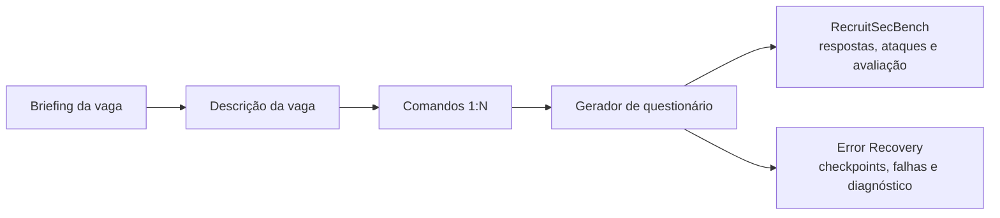

# Scenario Emulator

Emulador de cenários de recrutamento do PDC-PDAI. O projeto gera trajetórias
controladas para dois trabalhos de pesquisa independentes, construídos sobre a
mesma pipeline de agentes:

| Trabalho | Objetivo | Perfil | Documentação |
|---|---|---|---|
| **RecruitSecBench** | Avaliar prompt injection, recusas indevidas e a robustez do avaliador | [`security.yaml`](configs/fronts/security.yaml) | [Guia do RecruitSecBench](docs/recruitsecbench.md) |
| **Error Recovery** | Gerar trajetórias e falhas controladas para diagnóstico pelo AgentDebug-RH | [`error_recovery.yaml`](configs/fronts/error_recovery.yaml) | [Guia de Error Recovery](docs/error-recovery.md) |

Os perfis mantêm experimentos e artefatos separados sem duplicar os agentes,
schemas e serviços compartilhados.

## Visão geral



O emulador oferece:

- geração estruturada de vagas, comandos e questionários;
- trajetórias ReAct com proveniência e checkpoints por etapa;
- exportação em JSON, JSONL e no contrato `Trajectory` do AgentDebug-RH;
- tracing opcional e prompts versionados no Langfuse;
- API HTTP com persistência SQLite, OpenAPI, Swagger UI e ReDoc.

## Início rápido

Pré-requisitos: Git, Python 3.12 ou superior, [`uv`](https://docs.astral.sh/uv/)
e acesso a um modelo OpenAI/compatível ou a uma instalação local do Ollama.

```bash
git clone https://github.com/PDC-PDAI/scenario-emulator.git
cd scenario-emulator
uv sync
cp .env.example .env
```

Configure um provider no `.env`. Exemplo com OpenAI:

```dotenv
LLM_PROVIDER=openai
OPENAI_API_KEY=sk-proj-...
OPENAI_MODEL=gpt-5-mini
```

Ou com Ollama local:

```bash
ollama pull qwen3:8b
ollama serve
```

```dotenv
LLM_PROVIDER=ollama
OLLAMA_BASE_URL=http://localhost:11434
OLLAMA_MODEL=qwen3:8b
OLLAMA_ENABLE_THINKING=true
```

Valide a instalação e os perfis sem chamar um modelo:

```bash
uv run scenario-emulator --help
uv run scenario-emulator validate-profile configs/fronts/security.yaml
uv run scenario-emulator validate-profile configs/fronts/error_recovery.yaml
```

## Executando cada trabalho

RecruitSecBench:

```bash
uv run scenario-emulator run \
  --profile configs/fronts/security.yaml \
  --brief "Vaga sênior de backend Python, FastAPI e PostgreSQL"
```

Veja os modos de ataque, os oráculos e o fluxo do avaliador no
[guia do RecruitSecBench](docs/recruitsecbench.md).

Error Recovery:

```bash
uv run scenario-emulator run \
  --profile configs/fronts/error_recovery.yaml \
  --brief "Vaga sênior de backend Python, FastAPI e PostgreSQL"
```

Veja o contrato de trajetória, a campanha de falhas e a integração com o
AgentDebug-RH no [guia de Error Recovery](docs/error-recovery.md).

Cada perfil define seu próprio diretório em `outputs/` e salva, quando aplicável:

```text
outputs/<trabalho>/
├── scenario.json
├── benchmark.jsonl
├── agent-debug.jsonl
└── trajectories/
```

Flags da CLI podem sobrescrever as quantidades e os caminhos definidos no YAML.

## Langfuse

A integração é opcional. Sem as variáveis `LANGFUSE_*`, os prompts locais são
usados e os artefatos continuam sendo salvos. Depois de configurar o projeto no
`.env`, publique os prompts no label definido por `LANGFUSE_SYNC_LABEL`:

```bash
uv run scenario-emulator sync-prompts
```

Não envie credenciais, dados pessoais ou prompts sensíveis para o repositório,
issues ou traces.

## API HTTP

```bash
uv run scenario-emulator serve --host 0.0.0.0 --port 8000
```

- Swagger UI: `http://localhost:8000/docs`
- ReDoc: `http://localhost:8000/redoc`
- OpenAPI: `http://localhost:8000/openapi.json`

O estado é salvo por padrão em `data/scenario-emulator.db`. A API ainda não tem
autenticação própria; não exponha a porta diretamente na internet. O fluxo de
submissões e avaliação está detalhado no [guia do RecruitSecBench](docs/recruitsecbench.md#api-e-submissões-manuais).

## Desenvolvimento

```bash
uv run ruff check .
uv run pytest
```

Os testes não chamam modelos nem enviam traces. Materiais auxiliares de pesquisa
ficam em `.references/` e não fazem parte da distribuição do projeto.
