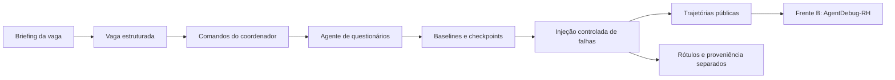

# Scenario Emulator · Frente A

🇧🇷 **Português** · [🇺🇸 English](README.en.md)

Simulador de falhas em agentes de recrutamento. Gera questionários, registra
trajetórias de execução e constrói datasets controlados para avaliar o
**AgentDebug-RH**, responsável por localizar a falha crítica e propor uma correção.

[Começar](#começar) · [Guia da Frente A](docs/error-recovery.md) ·
[Desenvolvimento](docs/error-recovery.md#arquitetura-e-desenvolvimento) · [Catálogo de falhas](docs/fault-injection-catalog.md) ·
[Contrato de dados](docs/data-contracts/agentdebug.md)



As campanhas permitem avaliar a localização da causa crítica em trajetórias
com falhas conhecidas e medir falsos positivos com controles de sucesso.

## Começar

Requisitos: **Python 3.12+**, Git, `uv` e um provider de LLM configurado para gerar
novas baselines. Testes e validação de configurações funcionam sem LLM.

```bash
git clone https://github.com/PDC-PDAI/scenario-emulator.git
cd scenario-emulator
uv sync --locked
cp .env.example .env
```

Edite o `.env` com seu provider. Exemplo:

```dotenv
LLM_PROVIDER=openai
OPENAI_API_KEY=your-key
OPENAI_MODEL=gpt-5-mini
```

Para Ollama, configure `LLM_PROVIDER=ollama`, `OLLAMA_BASE_URL` e `OLLAMA_MODEL`
conforme o [.env.example](.env.example). Langfuse é opcional; sem credenciais,
o runtime usa os prompts locais.

```bash
# Verificação offline
uv run scenario-emulator validate-profile configs/fronts/error_recovery.yaml
uv run pytest -q

# Uma baseline real; chama o provider configurado
uv run scenario-emulator run \
  --profile configs/fronts/error_recovery.yaml \
  --brief "Vaga sênior de backend Python, FastAPI e PostgreSQL" \
  --benign 1
```

`error_recovery` é o perfil padrão, inclusive sem `--profile`. Ele gera três
comandos benignos para coletar baselines do agente de questionários.

## Reproduzir as campanhas

| Configuração | Resultado planejado | Dependência |
|---|---|---|
| [100 casos](configs/campaigns/error-recovery-front-b-100.yaml) | Quatro classes de `action` | Novas baselines via LLM |
| [220 casos](configs/campaigns/error-recovery-front-b-220.yaml) | 20 casos por classe, 11 classes | Novas baselines via LLM |
| [1.100 casos](configs/campaigns/error-recovery-front-b-1100.yaml) | 100 casos por classe; cinco falhas distintas por baseline | Baselines privadas da campanha de 220; expansão offline |
| [1.200 casos v2](docs/dataset-v2-success-controls.md) | 1.100 falhas + 100 controles revisados | Pacote anterior, auditoria e controles aprovados |

```bash
uv run scenario-emulator run-dataset \
  --campaign configs/campaigns/error-recovery-front-b-220.yaml \
  --max-parallel 10

# Depois de concluir a coleta de 220 baselines:
uv run scenario-emulator run-dataset \
  --campaign configs/campaigns/error-recovery-front-b-1100.yaml
```

As mutações são aplicadas sobre checkpoints salvos de execuções reais. Elas são
**injeções sintéticas em trajetórias**, não novas execuções do agente sob falha.
Uma nova coleta com LLM reproduz o procedimento, mas não garante textos idênticos.
O clone não inclui os datasets históricos de `outputs/`.

```text
outputs/<campanha>/
├── front-b-input.jsonl   # entrada agregada para o detector
├── front-b-inputs/       # um JSON por trajetória
├── labels.json          # ground truth; somente para avaliação
└── private/             # baselines, checkpoints e proveniência
```

Mantenha rótulos fora da entrada do detector e agrupe derivados da mesma baseline
no mesmo split. Para medir falsos positivos com os controles v2, consulte o
[protocolo de avaliação cega](docs/dataset-v2-success-controls.md#como-avaliar-falsos-positivos).

## Integração com AgentDebug-RH

O [exemplo autocontido de `invalid_action`](examples/error_recovery/invalid_action/README.md)
funciona sem os datasets históricos. A Frente A produz o contrato `Trajectory`;
a Frente B gera o diagnóstico; o re-rollout pertence à Frente C. Este repo não
executa recuperação nem demonstra ganho após correção.

## Desenvolver

```bash
uv run ruff check .
uv run pytest -q
```

| Diretório | Responsabilidade |
|---|---|
| `src/services/questionnaire/` | Agente, tools e validação do formulário |
| `src/services/dataset/` | Coleta retomável, mutações e exportação de campanhas |
| `src/services/agent_debug/` | Conversão e anotações de trajetórias |
| `src/schemas/` | Contratos Pydantic e taxonomia |
| `src/prompts/` | Prompts locais e resolução opcional pelo Langfuse |
| `scripts/` | Sincronização de prompts e preparação de controles v2 |
| `tests/` | Contratos, integração, falhas e persistência sem chamadas a modelos |

Veja a [seção de desenvolvimento](docs/error-recovery.md#arquitetura-e-desenvolvimento)
para adicionar uma falha, alterar contratos e validar a construção dos datasets.

## Documentação bilíngue

| Assunto | Português | English |
|---|---|---|
| Execução e campanhas | [Guia](docs/error-recovery.md) | [Guide](docs/error-recovery.en.md) |
| Arquitetura e desenvolvimento | [Guia](docs/error-recovery.md#arquitetura-e-desenvolvimento) | [Guide](docs/error-recovery.en.md#architecture-and-development) |
| Injeção de falhas | [Catálogo](docs/fault-injection-catalog.md) | [Catalog](docs/fault-injection-catalog.en.md) |
| Contrato A → B | [Contrato](docs/data-contracts/agentdebug.md) | [Contract](docs/data-contracts/agentdebug.en.md) |
| Controles de sucesso v2 | [Protocolo](docs/dataset-v2-success-controls.md) | [Protocol](docs/dataset-v2-success-controls.en.md) |
