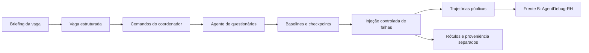

# Scenario Emulator · Frente A

🇧🇷 **Português** · [🇺🇸 English](README.en.md)

Simulador de falhas em agentes de recrutamento. Gera questionários, registra
trajetórias de execução e constrói datasets controlados para avaliar o
**AgentDebug-RH**, responsável por localizar a falha crítica e propor uma correção.

[Começar](#começar) · [Guia da Frente A](docs/error-recovery.md) ·
[Desenvolvimento](docs/error-recovery.md#arquitetura-e-desenvolvimento) · [Catálogo de falhas](docs/fault-injection-catalog.md) ·
[Contrato de dados](docs/data-contracts/agentdebug.md)



As campanhas permitem avaliar a localização da causa crítica em trajetórias
com falhas conhecidas e medir falsos positivos com controles de sucesso.

## Começar

Requisitos: **Python 3.12+**, Git, `uv` e um provider de LLM configurado para gerar
novas baselines. Testes e validação de configurações funcionam sem LLM.

```bash
git clone https://github.com/PDC-PDAI/scenario-emulator.git
cd scenario-emulator
uv sync --locked
cp .env.example .env
```

Edite o `.env` com seu provider. Exemplo:

```dotenv
LLM_PROVIDER=openai
OPENAI_API_KEY=your-key
OPENAI_MODEL=gpt-5-mini
```

Para Ollama, configure `LLM_PROVIDER=ollama`, `OLLAMA_BASE_URL` e `OLLAMA_MODEL`
conforme o [.env.example](.env.example). Langfuse é opcional; sem credenciais,
o runtime usa os prompts locais.

```bash
# Verificação offline
uv run scenario-emulator validate-profile configs/fronts/error_recovery.yaml
uv run pytest -q

# Uma baseline real; chama o provider configurado
uv run scenario-emulator run \
  --profile configs/fronts/error_recovery.yaml \
  --brief "Vaga sênior de backend Python, FastAPI e PostgreSQL" \
  --benign 1
```

`error_recovery` é o perfil padrão, inclusive sem `--profile`. Ele gera três
comandos benignos para coletar baselines do agente de questionários.

## Campanha atual: 300 amostras por modelo

A [campanha fixa](configs/campaigns/front-a-fixed-300.yaml) começa pelo
**Gemma 4 31B**, via OpenRouter: **300 amostras no total, sendo 60 corretas e
240 com erro injetado**. São 300 comandos distintos e versionados:
10 vagas × 30 comandos, com as mesmas vagas, IDs, diretrizes e prompts locais
para todos os modelos. Vaga e comandos não são gerados novamente por LLM.
O [corpus compartilhado](configs/inputs/front-a-300.json) contém as entradas completas.

Configure `OPENROUTER_API_KEY` no `.env` (veja [.env.example](.env.example)) e execute:

```bash
uv sync --locked

# Valida a campanha e as 300 entradas, sem chamar LLM.
uv run scenario-emulator validate-dataset-campaign configs/campaigns/front-a-fixed-300.yaml

# Piloto com apenas 5 amostras do Gemma 4 31B.
uv run scenario-emulator run-dataset \
  --campaign configs/campaigns/front-a-fixed-300.yaml \
  --limit 5 \
  --output-dir outputs/front-a-smoke-5/gemma-4-31b

# Coleta completa: 300 amostras do Gemma 4 31B.
uv run scenario-emulator run-dataset \
  --campaign configs/campaigns/front-a-fixed-300.yaml

# Mesmas 300 entradas e mesmos parâmetros; muda somente o modelo.
uv run scenario-emulator run-dataset \
  --campaign configs/campaigns/front-a-fixed-300.yaml \
  --model google/gemma-4-26b-a4b-it

uv run scenario-emulator run-dataset \
  --campaign configs/campaigns/front-a-fixed-300.yaml \
  --model qwen/qwen3.5-9b
```

O YAML fixa `temperature=0`, `top_p=1`, `max_tokens=8192`, reasoning desativado,
2 retries de transporte, timeout de 120 segundos e seed 42 para distribuir as
falhas. O OpenRouter recebe `require_parameters=true` e `allow_fallbacks=false`.
Os IDs foram conferidos no catálogo: [Gemma 31B](https://openrouter.ai/google/gemma-4-31b-it),
[Gemma 26B](https://openrouter.ai/google/gemma-4-26b-a4b-it) e
[Qwen 9B](https://openrouter.ai/qwen/qwen3.5-9b).
O nome **“GLM 3.5 Flash 320B” ainda precisa de confirmação**; nenhum outro
modelo foi colocado no lugar. Depois de confirmar, use seu ID em `--model`.

**Distribuição:** `success_controls: 60` reserva seis controles corretos por vaga,
selecionados com seed fixa. Os 240 casos restantes recebem os onze tipos de falha:
22 por tipo, exceto `system_llm_limit` e `system_environment_error`, com 21 cada.
A mesma posição é controle ou recebe o mesmo tipo de erro em todos os modelos.
O piloto usa o prefixo exato da campanha completa; cinco casos não representam
as proporções globais.

**Entrada do detector e métricas:** use `detector-input.jsonl`, que contém somente
`trajectory_id`, `task_description`, `environment` e `steps`, misturando controles
e falhas. `labels.json` fica separado: `null` significa nenhuma falha esperada;
os outros valores têm `step`, `module` e `error_type`. Cruze as predições com os
rótulos por `trajectory_id` somente depois da inferência. Não entregue ao detector
os rótulos, o manifesto, a atribuição de falhas nem o campo `success`.
`front-b-input.jsonl` preserva o contrato legado com `success` para integração;
como a Frente B pode pular casos com `success=true`, use a entrada cega e processe
todos os casos para medir falsos positivos. Veja o
[protocolo de avaliação](docs/dataset-v2-success-controls.md#como-avaliar-falsos-positivos).

**Distribuição por passo:** `invalid_action`, `action_format_error`,
`system_tool_execution_error` e `system_llm_limit` alternam entre os passos com
chamadas de ferramentas válidas, usando três variantes por posição. Ao injetar
antes do fim, a trajetória é truncada no erro para não apresentar uma continuação
bem-sucedida fictícia. Os demais tipos preservam a posição semanticamente necessária
(por exemplo, salvar antes de consultar ou corromper o payload ao salvar).
Não acrescentamos passos só para balancear posições. Em baselines de dois passos,
a distribuição planejada dos 240 erros é 92 no passo 1 e 148 no passo 2; com mais passos,
os tipos flexíveis também cobrem posições intermediárias. A distribuição real,
inclusive tipo × passo e comprimento original, fica em `private/distribution.json`.

**Reprodução e retomada:** repita o mesmo comando e diretório para reutilizar os
checkpoints aprovados. Uma baseline que falha ou contém erro natural recuperado fica pendente com seu ID original;
a próxima execução repete o mesmo comando, sem substituí-lo nem deslocar os rótulos.
O processo retorna código 2 enquanto houver pendências; apenas uma baseline válida
recebe a falha sintética. Cada caso de falha contém uma injeção; os controles preservam a trajetória correta.
Controles exigem lookup e salvamento bem-sucedidos, com chamadas e respostas
consistentes no histórico completo.
Mudar modelo, parâmetros, corpus, código, dependências ou limite exige outro diretório.
O manifesto privado registra esses dados e hashes. Tentativas rejeitadas são preservadas em `private/rejected-executions/`. Use diretórios separados para
piloto e coleta completa. Ao avaliar, mantenha os mesmos IDs de entrada no mesmo
split entre modelos.

Temperatura 0 fixa a política de amostragem, mas o OpenRouter e seus backends não
garantem respostas idênticas em novas chamadas. O protocolo fixa entradas,
parâmetros e mutações; os checkpoints preservam os resultados já coletados.

## Reproduzir as campanhas

| Configuração | Resultado planejado | Dependência |
|---|---|---|
| [100 casos](configs/campaigns/error-recovery-front-b-100.yaml) | Quatro classes de `action` | Novas baselines via LLM |
| [220 casos](configs/campaigns/error-recovery-front-b-220.yaml) | 20 casos por classe, 11 classes | Novas baselines via LLM |
| [1.100 casos](configs/campaigns/error-recovery-front-b-1100.yaml) | 100 casos por classe; cinco falhas distintas por baseline | Baselines privadas da campanha de 220; expansão offline |
| [1.200 casos v2](docs/dataset-v2-success-controls.md) | 1.100 falhas + 100 controles revisados | Pacote anterior, auditoria e controles aprovados |

```bash
uv run scenario-emulator run-dataset \
  --campaign configs/campaigns/error-recovery-front-b-220.yaml \
  --max-parallel 10

# Depois de concluir a coleta de 220 baselines:
uv run scenario-emulator run-dataset \
  --campaign configs/campaigns/error-recovery-front-b-1100.yaml
```

As mutações são aplicadas sobre checkpoints salvos de execuções reais. Elas são
**injeções sintéticas em trajetórias**, não novas execuções do agente sob falha.
Uma nova coleta com LLM reproduz o procedimento, mas não garante textos idênticos.
O clone não inclui os datasets históricos de `outputs/`.

```text
outputs/<campanha>/
├── front-b-input.jsonl   # entrada agregada para o detector
├── front-b-inputs/       # um JSON por trajetória
├── labels.json          # ground truth; somente para avaliação
└── private/             # baselines, checkpoints e proveniência
```

Mantenha rótulos fora da entrada do detector e agrupe derivados da mesma baseline
no mesmo split. Para medir falsos positivos com os controles v2, consulte o
[protocolo de avaliação cega](docs/dataset-v2-success-controls.md#como-avaliar-falsos-positivos).

## Integração com AgentDebug-RH

O [exemplo autocontido de `invalid_action`](examples/error_recovery/invalid_action/README.md)
funciona sem os datasets históricos. A Frente A produz o contrato `Trajectory`;
a Frente B gera o diagnóstico; o re-rollout pertence à Frente C. Este repo não
executa recuperação nem demonstra ganho após correção.

## Desenvolver

```bash
uv run ruff check .
uv run pytest -q
```

| Diretório | Responsabilidade |
|---|---|
| `src/services/questionnaire/` | Agente, tools e validação do formulário |
| `src/services/dataset/` | Coleta retomável, mutações e exportação de campanhas |
| `src/services/agent_debug/` | Conversão e anotações de trajetórias |
| `src/schemas/` | Contratos Pydantic e taxonomia |
| `src/prompts/` | Prompts locais e resolução opcional pelo Langfuse |
| `scripts/` | Sincronização de prompts e preparação de controles v2 |
| `tests/` | Contratos, integração, falhas e persistência sem chamadas a modelos |

Veja a [seção de desenvolvimento](docs/error-recovery.md#arquitetura-e-desenvolvimento)
para adicionar uma falha, alterar contratos e validar a construção dos datasets.

## Documentação bilíngue

| Assunto | Português | English |
|---|---|---|
| Execução e campanhas | [Guia](docs/error-recovery.md) | [Guide](docs/error-recovery.en.md) |
| Arquitetura e desenvolvimento | [Guia](docs/error-recovery.md#arquitetura-e-desenvolvimento) | [Guide](docs/error-recovery.en.md#architecture-and-development) |
| Injeção de falhas | [Catálogo](docs/fault-injection-catalog.md) | [Catalog](docs/fault-injection-catalog.en.md) |
| Contrato A → B | [Contrato](docs/data-contracts/agentdebug.md) | [Contract](docs/data-contracts/agentdebug.en.md) |
| Controles de sucesso v2 | [Protocolo](docs/dataset-v2-success-controls.md) | [Protocol](docs/dataset-v2-success-controls.en.md) |
